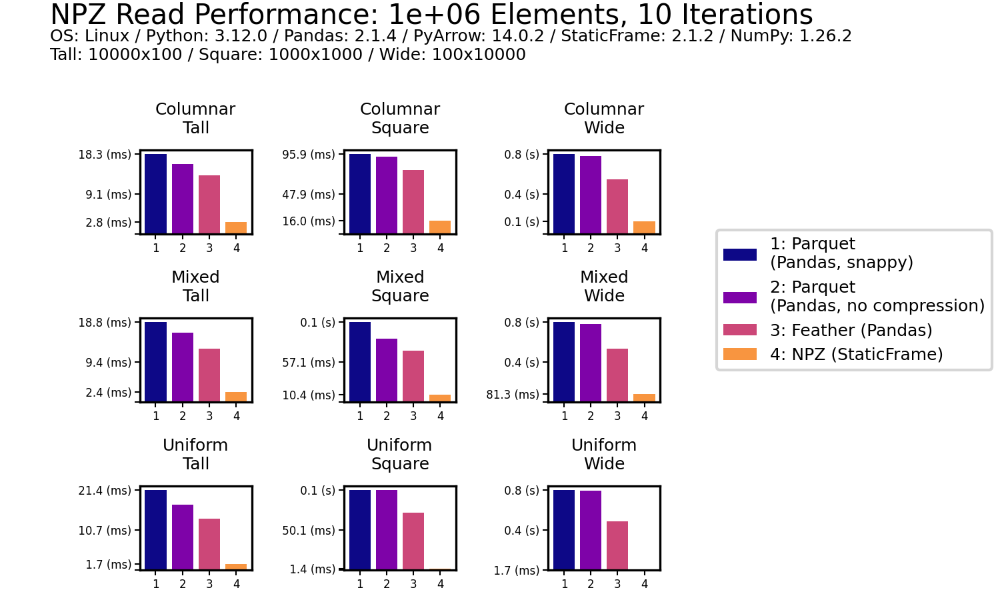

# Read and Write DataFrames Faster than Parquet with StaticFrame NPZ Serialization

# Serialize DataFrames Two to Ten Times Faster than Parquet with StaticFrame NPZ


The Apache Parquet format provides an efficient binary representation of columnar table data, as seen with widespread use in Apache Hadoop and Spark, AWS Athena and Glue, and Pandas DataFrame serialization. While Parquet offers interoperability across many systems with performance superior to text formats (such as CSV or JSON), it is as much as ten times slower than NPZ, an alternative DataFrame serialization format introduced in StaticFrame [https://github.com/static-frame/static-frame].

StaticFrame (an open-source DataFrame library of which I am an author) builds upon NumPy NPY and NPZ formats to offer this high-performance alternative to Parquet. The NPY format (a binary encoding of array data) and the NPZ format (zipped bundles of NPY files) were defined in the first NumPy Enhancement Proposal in 2007 [https://numpy.org/neps/nep-0001-npy-format.html]. By extending the NPZ format with specialized JSON metadata, StaticFrame provides a complete DataFrame serialization format that supports all NumPy dtypes.


## The Challenge of Serializing DataFrames

DataFrames are not just collections of columnar data with string column labels, such as found in relational databases. In addition to columnar data, DataFrames have labelled rows and columns, and those row and column labels can be of any type or (with hierarchical labels) many types.

As Parquet was originally designed to just store collections of columnar data, the full range of DataFrame characteristics is not natively supported. Pandas supplies this additional information by adding JSON metadata into the Parquet file. Further, Parquet does not support the full range of NumPy dtypes.

While Python pickles are capable of efficiently serializing DataFrames and NumPy arrays, they are only suitable for short-term caches from trusted sources. While Pickles are fast, they can become invalid due to code changes and are insecure to load from untrusted sources.

Another alternative to Parquet, originating in the Arrow project, is Feather. While Feather succeeds in being faster than Parquet, it is still two times slower at reading DataFrames than NPZ.

Parquet and Feather support compression to reduce file size on disk. Parquet defaults to using "snappy" compression, while Feather uses "lz4". As the NPZ format prioritizes performance, it does not yet support compression. As will be shown below, uncompressed NPZ file sizes are (for the data sets benchmarked) comparable to compressed Parquet and Feather.


## DataFrame Serialization Performance Comparisons

First, read and write performance will be examined; second, the details of encoding a DataFrame with NPY and NPZ will be described.

Numerous publications offer DataFrame performance comparisons by testing just a few data sets [https://ursalabs.org/blog/2020-feather-v2/]. This is insufficient, as both the shape of the DataFrame, as well as the degree of columnar type heterogeneity, can make a significant difference in performance.

To avoid this problem, I present nine performance results across two dimensions of synthetic fixtures: shape (tall, square, and wide) and columnar heterogeneity (columnar, mixed, and uniform). Shape variations alter the distribution of the same number of elements between tall (e.g., 10,000 rows and 100 columns), square (e.g., 1,000 rows and columns), and wide (e.g., 100 rows and 10,000 columns) geometries. Columnar heterogeneity variations alter the diversity of types between columnar (no adjacent columns have the same type), mixed (some adjacent columns have the same type), and uniform (all columns have the same type).

The `frame-fixtures` library defines a domain-specific language to create deterministic but randomly-generated DataFrames for testing; the nine variations of DataFrames are generated with this tool. The following IPython session performs a basic perforamnce test using `%time`.

```python
>>> import numpy as np
>>> import static_frame as sf
>>> import pandas as pd

>>> array = np.random.random_sample((10_000, 10_000))

>>> f1 = sf.Frame(array)
>>> %time f1.to_npz('/tmp/frame.npz')
CPU times: user 1.2 s, sys: 812 ms, total: 2.01 s
Wall time: 2.03 s

>>> df1 = pd.DataFrame(array)
>>> %time df1.to_parquet('/tmp/df.parquet')
CPU times: user 14.1 s, sys: 1.44 s, total: 15.5 s
Wall time: 15.6 s
```

Plotted performance tests, as shown below, extend this basic approach by using ``frame-fiuxtures`` for systematic variation of shape, type heterogeneity, and average results over ten iterations.


### Read Performance

As data is generally read more often then it is written, read performance is a priority. As shown for all nine DataFrames of one million (1e+06) elements, NPZ significantly outperforms Parquet and Feather with every fixture. NPZ read performance is nearly ten times faster than compressed Parquet. For example, with the Uniform Tall fixture, compressed Parquet reading is 21 ms compared to 1.5 ms with NPZ.

The chart below shows processing time, where lower bars correspond to faster performance.




The impressive performance of NPZ is retained with scale. Moving to 100 million (1e+08) elements, NPZ continues to be at least twice as fast as Parquet and Feather, regardless of of if compression is used or not.


### Write Performance

As data is generally read more often then it is written, write performance is secondary. Nonetheless, NPZ outperforms Parquet (both compressed and uncompressed) in all scenarioes. For example, with the Uniform Square fixture, compressed Parquet writing is 200 ms compared to 18.3 ms with NPZ.


As with read performance tests, the impressive performance of NPZ is retained with scale. Moving to 100 million (1e+08) elements, NPZ continues to be at least twice as fast as Parquet, regardless of of if compression is used or not. Feather performance (both compressed and uncompressed) out-performs NPZ in a few scenarios by a small amount, but NPZ write performance is generally comparable to Feather (and in a few scenarios faster).


## Encoding a DataFrame in NPY and NPZ

A StaticFrame DataFrame can be thought of as a collection of 1D and 2D arrays and metadata. The arrays represent columnar values as well as variable-depth index and column labels. The metadata represents index and column types as well as ``name`` attributes values.


### Encoding Arrays in NPY


### Encoding DataFrame Metadata in JSON


# Size on Disk


# Conclusion


