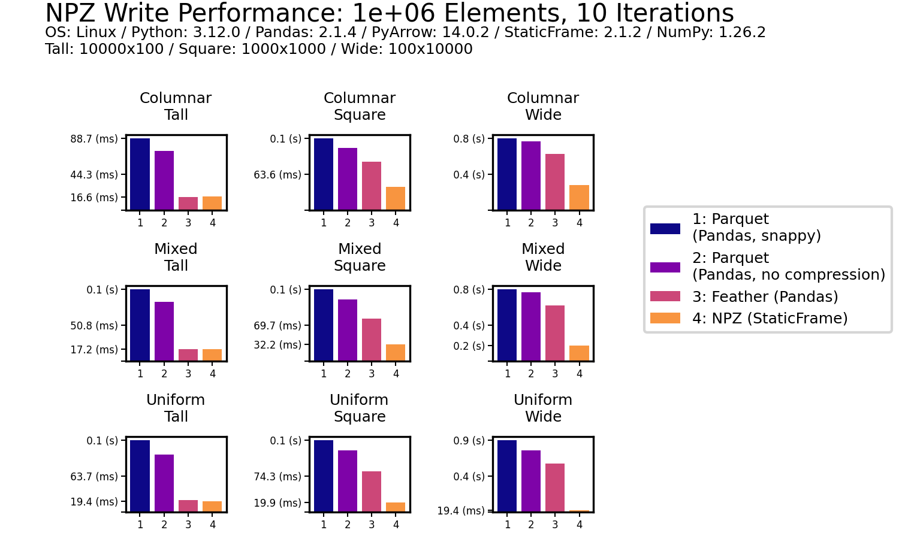
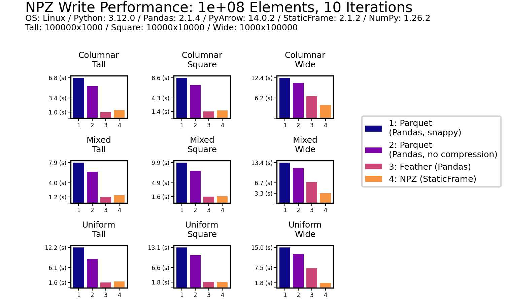

# Faster DataFrame Serialization
<!-- Read and Write DataFrames Up to Ten Times Faster than Parquet with StaticFrame NPZ -->


The Apache Parquet format provides an efficient binary representation of columnar table data, as seen with widespread use in Apache Hadoop and Spark, AWS Athena and Glue, and Pandas DataFrame serialization. While Parquet offers interoperability across many systems with performance superior to text formats (such as CSV or JSON), it is as much as ten times slower than NPZ, an alternative DataFrame serialization format introduced in StaticFrame [https://github.com/static-frame/static-frame].

StaticFrame (an open-source DataFrame library of which I am an author) builds upon NumPy NPY and NPZ formats to offer this high-performance alternative to Parquet. The NPY format (a binary encoding of array data) and the NPZ format (zipped bundles of NPY files) are defined in a NumPy Enhancement Proposal from 2007 [https://numpy.org/neps/nep-0001-npy-format.html]. By extending the NPZ format with specialized JSON metadata, StaticFrame provides a complete DataFrame serialization format that supports all NumPy dtypes.

This article extends work first presented at PyCon USA 2022 [https://youtu.be/HLH5AwF-jx4?si=9NSpPuf-jVoxotzg].


## The Challenge of Serializing DataFrames

DataFrames are not just collections of columnar data with string column labels, such as found in relational databases. In addition to columnar data, DataFrames have labelled rows and columns, and those row and column labels can be of any type or (with hierarchical labels) many types. Further, it is common to store metadata with a ``name`` attribute, either on the DataFrame or on the axis labels.

As Parquet was originally designed just to store collections of columnar data, the full range of DataFrame characteristics is not directly supported. Pandas supplies this additional information by adding JSON metadata into the Parquet file.

As Parquet was designed to support a minimal selection of types, the full range of NumPy dtypes is not directly supported. For example, Parquet does not natively support unsigned integers or any datetime or timedelta types.

While Python pickles are capable of efficiently serializing DataFrames and NumPy arrays, they are only suitable for short-term caches from trusted sources. While pickles are fast, they can become invalid due to code changes and are insecure to load from untrusted sources.

Another alternative to Parquet, originating in the Arrow project, is Feather. While Feather supports all Arrow types and succeeds in being faster than Parquet, it is still at least two times slower reading DataFrames than NPZ.

Parquet and Feather support compression to reduce file size on disk. Parquet defaults to using "snappy" compression, while Feather defaults to "lz4". As the NPZ format prioritizes performance, it does not yet support compression. As will be shown below, NPZ outperforms both compressed and uncompressed Parquet and Feather files. File size comparisons will be provided.


## DataFrame Serialization Performance Comparisons

Numerous publications offer DataFrame benchmarks by testing just one or two datasets. McKinney and Richardson [https://ursalabs.org/blog/2020-feather-v2] (2020) offer an example, where two datasets, Fannie Mae Loan Performance and NYC Yellow Taxi Trip data, are used to generalize about performance. Such idiosyncratic data sets are insufficient, as both the shape of the DataFrame and the degree of columnar type heterogeneity can significantly differentiate performance.

To avoid this deficiency, I compare performance with a panel of nine synthetic datasets. These datasets vary along two dimensions: shape (tall, square, and wide) and columnar heterogeneity (columnar, mixed, and uniform). Shape variations alter the distribution of elements between tall (e.g., 10,000 rows and 100 columns), square (e.g., 1,000 rows and columns), and wide (e.g., 100 rows and 10,000 columns) geometries. Columnar heterogeneity variations alter the diversity of types between columnar (no adjacent columns have the same type), mixed (some adjacent columns have the same type), and uniform (all columns have the same type).

The ``frame-fixtures`` [https://github.com/static-frame/frame-fixtures] library defines a domain-specific language to create deterministic but randomly-generated DataFrames for testing; the nine datasets are generated with this tool.

To demonstrate some of the StaticFrame and Pandas interfaces evaluated, the following IPython session performs basic performance tests using ``%time``. As shown below, using NPZ, a square, uniformly-typed DataFrame can be written and read many times faster than uncompressed Parquet.

```python
>>> import numpy as np
>>> import static_frame as sf
>>> import pandas as pd

>>> # an square, uniform float array
>>> array = np.random.random_sample((10_000, 10_000))

>>> # write peformance
>>> f1 = sf.Frame(array)
>>> %time f1.to_npz('/tmp/frame.npz')
CPU times: user 715 ms, sys: 394 ms, total: 1.11 s
Wall time: 1.23 s

>>> df1 = pd.DataFrame(array)
>>> %time df1.to_parquet('/tmp/df.parquet', compression=None)
CPU times: user 5.87 s, sys: 790 ms, total: 6.66 s
Wall time: 6.81 s

>>> # read performance
>>> %time f2 = f1.from_npz('/tmp/frame.npz')
CPU times: user 0 ns, sys: 281 ms, total: 281 ms
Wall time: 279 ms

>>> %time df2 = pd.read_parquet('/tmp/df.parquet')
CPU times: user 6.05 s, sys: 7.65 s, total: 13.7 s
Wall time: 1.85 s
```

Performance tests, shown below, extend this basic approach by using ``frame-fixtures`` for systematic variation of shape and type heterogeneity, and average results over ten iterations. For all interfaces, the default configuration is used (except for disabling compression). The code used to perform these tests is available at GitHub [https://github.com/static-frame/static-frame/blob/master/doc/source/articles/serialize.py].


### Read Performance

As data is generally read more often then it is written, read performance is a priority. As shown for all nine DataFrames of one million (1e+06) elements, NPZ significantly outperforms Parquet and Feather with every fixture. NPZ read performance is nearly ten times faster than compressed Parquet. For example, with the Uniform Tall fixture, compressed Parquet reading is 21 ms compared to 1.5 ms with NPZ.

The chart below shows processing time, where lower bars correspond to faster performance.


This impressive NPZ performance is retained with scale. Moving to 100 million (1e+08) elements, NPZ continues to perform at least twice as fast as Parquet and Feather, regardless of if compression is used.


### Write Performance

NPZ outperforms Parquet (both compressed and uncompressed) in all write scenarios. For example, with the Uniform Square fixture, compressed Parquet writing is 200 ms compared to 18.3 ms with NPZ. NPZ write performance is generally comparable to Feather (both compressed and uncompressed): in some scenarios NPZ is faster, in others, Feather is faster.




As with read performance, NPZ write performance is retained with scale. Moving to 100 million (1e+08) elements, NPZ continues to be at least twice as fast as Parquet, regardless of if compression is used or not.




### Read and Write Performance with a Singular Case

As an additional reference, we will also benchmark the same NYC Yellow Taxi Trip data (from January 2010) used in McKinney and Richardson [https://ursalabs.org/blog/2020-feather-v2] (2020).

NPZ read performance is shown to be approximately four times faster than Parquet and Feather (with or without compression). While NPZ write performance is faster than Parquet, Feather writing is fastest.


### File Size

As shown below for 1e+06 and 1e+08 element DataFrames, uncompressed NPZ is generally equal in size on disk to uncompressed Feather and always smaller than uncompressed Parquet (sometimes smaller than compressed Parquet too). As expected, compression provides modest file-size reductions for Parquet and Feather compared to uncompressed formats.


## Serializing DataFrames

StaticFrame stores data as a collection of 1D and 2D NumPy arrays. Arrays represent columnar values, as well as variable-depth index and column labels. In addition to NumPy arrays, information about component types (i.e., the Python class used for the index and columns), as well as the component ``name`` attributes, are needed to fully reconstruct a ``Frame``. Completely serializing a DataFrame requires writing and reading these components to a file.

DataFrame components can be represented by the following diagram, which isolates arrays, array types, component types, and component names. This diagram will be used to demonstrate how an NPZ stores DataFrame components.


The components of that diagram map to components of a ``Frame`` string representation in Python. For example, given a ``Frame`` of integers and Booleans with hierarchical labels on both the index and columns, StaticFrame provides the following string representation:

```python
>>> frame
<Frame: p>
<IndexHierarchy: q>       data    data    data    valid  <<U5>
                          A       B       C       *      <<U1>
<IndexHierarchy: r>
2012-03             x     5       4       7       False
2012-03             y     9       1       8       True
2012-04             x     3       6       2       True
<datetime64[M]>     <<U1> <int64> <int64> <int64> <bool>
```

The components of the string representation can be mapped to the DataFrame diagram by color:


### Encoding an Array in NPY

An NPY file stores an NumPy array as a binary file with six components: (1) a "magic" prefix, (2) a version number, (3) a header length and (4) header (where the header is a string representation of a Python dictionary), and (5) padding followed by (6) raw array byte data. These components are shown below for a three-element binary array stored in a file named "\__blocks_1__.npy".


Given an NPZ file named "frame.npz", we can extract that binary data by reading the NPY file from the NPZ with the standard library's ``ZipFile``:

```python
>>> from zipfile import ZipFile
>>> with ZipFile('/tmp/frame.npz') as zf: print(zf.open('__blocks_1__.npy').read())
b'\x93NUMPY\x01\x006\x00{"descr":"|b1","fortran_order":True,"shape":(3,)}    \n\x00\x01\x01
```

As NPY is the standard binary file representation of NumPy arrays, the ``np.load()`` function can be used to convert this file to a NumPy array. This means that underlying array data in a StaticFrame NPZ is easily extractable by alternative readers.

```python
>>> with ZipFile('/tmp/frame.npz') as zf: print(repr(np.load(zf.open('__blocks_1__.npy'))))
array([False,  True,  True])
```

As a NPY file can encode any array, large two-dimensional arrays can be loaded from contiguous byte data, providing excellent performance in StaticFrame when multiple contiguous columns are represented by a single array.


### Building a NPZ File

A NPZ is a standard (often uncompressed) ZIP file that contains array data in NPY files and metadata (containing component types and names) in a JSON file.

Given the NPZ file for the ``Frame`` above, we can list its contents with ``ZipFile``. The archive contains six NPY files and one JSON file.

```python
>>> with ZipFile('/tmp/frame.npz') as zf: print(zf.namelist())
['__values_index_0__.npy', '__values_index_1__.npy', '__values_columns_0__.npy', '__values_columns_1__.npy', '__blocks_0__.npy', '__blocks_1__.npy', '__meta__.json']
```

The illustration below maps these files to components of the DataFrame diagram.


StaticFrame extends the NPZ format to include metadata in a JSON file. This file defines name attributes, component types, and depth counts.

```python
>>> with ZipFile('/tmp/frame.npz') as zf: print(zf.open('__meta__.json').read())
b'{"__names__": ["p", "r", "q"], "__types__": ["IndexHierarchy", "IndexHierarchy"], "__types_index__": ["IndexYearMonth", "Index"], "__types_columns__": ["Index", "Index"], "__depths__": [2, 2, 2]}'
```


In the illustration below, components of the ``__meta__.json`` file are mapped to components of the DataFrame diagram.


As a simple ZIP file, tools to extract the contents of a StaticFrame NPZ are ubiquitous. On the other hand, the ZIP format, given its history and generality, incurs performance overhead. StaticFrame implements a custom ZIP reader optimized for NPZ usage, which contributes to the excellent read performance of NPZ.


# Conclusion

The performance of DataFrame serialization is critical to many applications. While Parquet has widespread support, its generality compromises type specificity and performance. NPZ read performance outperforms Parquet and Feather by significant multiples, regardless of if compression is used. While NPZ write performance is comparable to Feather, it still out performs Parquet, all while fully supporting all NumPy dtypes.


